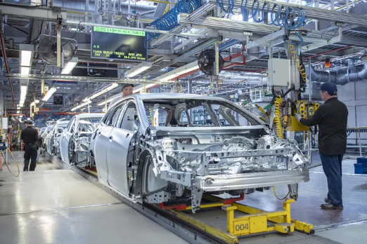

#
# Salifort Motors Capstone Project: 
## Understanding Employee Attrition Through Machine Learning

Photo Credits: Monty Rakusen / Getty Images

#

**Author:** Kevin Leung

**Date:** 2025-04-21

#
[**Executive Summary**](https://github.com/kleung157/Salifort_Motors_Capstone_Machine_Learning/blob/main/images/executive_summary.png)

[**Full Python Jupyter Notebook**](https://github.com/kleung157/Bellabeat_Case_Study_Google_Data_Analytics/blob/ba4e810b2ea8f7d907c0e844fd44f2d4f9583cc6/bellabeat_case_study_deliverables.Rmd)

[**Dashboard**](https://public.tableau.com/views/salifort_motors_capstone/DashboardStory?:language=en-US&:sid=&:redirect=auth&:display_count=n&:origin=viz_share_link)

[**Presentation**](https://github.com/kleung157/Bellabeat_Case_Study_Google_Data_Analytics/raw/refs/heads/main/bellabeat_presentation.pptx)

#

**Data Analysis Contents:**

1. Plan

2. Analyze

3. Construct

4. Execute

#

## 1. Plan

## 2. Analyze

## 3. Construct

## 4. Execute

