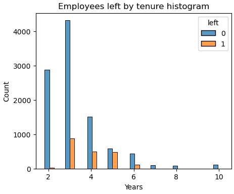
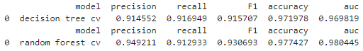
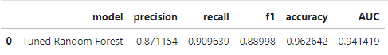
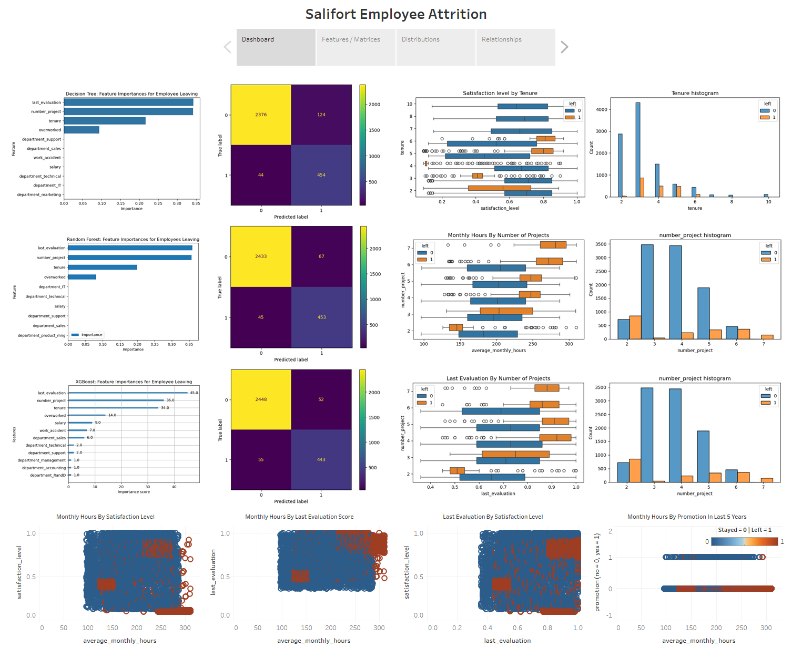

#
# Salifort Motors Capstone Project: 
## Understanding Employee Attrition Through Machine Learning

###### Credits: Monty Rakusen / Getty Images

#

**Author:** Kevin Leung

**Date:** 2025-04-21

#

**Deliverables:**

[**Executive Summary**](https://github.com/kleung157/Salifort_Motors_Capstone_Machine_Learning/blob/main/images/executive_summary.png)

[**Full Python Jupyter Notebook**](https://github.com/kleung157/Salifort_Motors_Capstone_Machine_Learning/blob/2e3791a1d06dfbc67ab287fd00a89724e6f827f6/salifort_capstone_trim.ipynb)

[**Dashboard**](https://public.tableau.com/views/salifort_motors_capstone/DashboardStory?:language=en-US&:sid=&:redirect=auth&:display_count=n&:origin=viz_share_link)

[**Presentation**]

#

### **Contents:**

**Plan**
- Establish structure for project workflow; use plan, analyze, construct and execute (PACE).
- Write a project proposal.
- Compile summary information about the data.
- Begin looking at data through exploratory data analysis (EDA).

**Analyze**
- Data exploration and cleaning.
- Visualization building.
- Compute descriptive statistics.
- Conduct hypothesis testing.

**Construct**
- Build a regression model.
- Evaluate regression model.
- Build a machine learning models.
- Evaluate machine learning models.

**Execute**
- Interpret models.
- Continually iterate and fine-tune models to generate best performance for data.
- Communicate final insights with stakeholders (executive summary, dashboard, presentation).
  
# 

## Plan
**Background:**

"Currently, there is a high rate of turnover among Salifort employees (turnover data includes both employees who choose to quit their job and employees who are let go). Salifort's senior leadership is concerned about how many employees are leaving the company. Salifort strives to create a corporate culture that supports employee success and professional development. Further, the high turnover rate is costly in the financial sense. Salifort makes a big investment in recruiting, training and upskilling its employees. Salifort Human Resources surveyed a sample of employees to learn more about what might be driving turnover. The Salifort data team was asked to analyze the survey data and come up with ideas for how to increase employee retention."
  
**Stakeholders:**

The stakeholders are Salifort Senior Leadership and Salifort Human Resources.

**Objective:**

Build a logistic regression or machine learning model that predicts what factors likely contribute to employees leaving the company. An accurate model will help the company improve employee retention and minimize loss of allocated resources to the hiring process.

**Initial Exploratory Data Analysis (EDA) Observations:**
- 14,999 rows of data and 10 columns. 
- Columns are mostly integers/floats with the exception of 'Department' and 'salary' which are strings.
- No missing or null values in the dataset.
- After removing 3008 duplicates, there are 11,991 rows.
- Columns descriptive statistics, specifically 'number_projects', 'average_monthly_hours', and 'time_spend_company' show a fairly wide range from minimum to max values.
- Columns descriptive statistics fall within close mean and median 50% values with the exception of 'time_spend_company' whose mean is 3.498 and median is 3.000.
- Renamed 'Work_accident', 'Department', 'average_montly_hours', 'time_spend_company' to 'work_accident', 'department', 'average_monthly_hours', 'tenure' to standardize spelling and snake_case format.
- There are 824 outliers in the 'tenure' column using interquartile range (IQR) and boxplot visualization.

**Resources:**
- Google Gemini - suggestions for Python package imports and EDA functions.
- Jupyter Notebooks - referencing past Python learning modules for import packages and codes.

**Ethical Considerations:**
- Sample size is 14999. May not have sufficient data to represent the test population.
- 3008 duplicates were removed which is 20% of the data.

#

## Analyze
**Observations of Variable Distributions:**

- 1991 (16.6%) employees left and 10000 (83.4%) stayed out of 11991 employees.

- 1850 (15.4%) employees had work accidents and 10141 (84.6%) did not out of 11991 employees.

- 203 (1.7%) employees had promotions within the last 5 years and 11788 (98.3%) did not out of 11991 employees.

- 'satisfaction_level', 'last_evaluation', 'number_project', 'tenure', 'average_monthly_hours' have a visible histogram distribution in the pairplots.
- 'left', 'promotion_last_5years', 'work_accident' are binary coded so the distribution outcomes are just 0 and 1 in the pairplots.
- None of the column variables show a clear linearity between variables for scatterplots.

- The median self percieved 'satisfaction_level' of employees falls within an interquartile range of 0.5 to 0.8 in the boxplot.
- The 'satisfaction_level' variable follows a left-skewed distribution with half of the observations having 0.66 or more level of satisfaction in the histogram.
- The mean 0.63 is lower than the median 0.66 and there are no notable outliers present.
- However, there seems to be a significant count of ~500 observations at 0 and 0.5 satisfaction_level that does affects the left skew distribution.

- The median employee 'last_evaluation' performance review fall within a interquartile range of ~0.6 to 0.85 in the boxplot.
- The 'last_evaluation' variable follows a uniform distribution more closely than a left skew distribution in the histogram.
- Counts are noticeably lower for 'last_evaluation' at ~0.4.
- The mean and median are both 0.72 with no notable outliers present.

- The median number of projects employees contribute to falls within the interquartile range of 3-5 projects in the boxplot.
- The 'number_project' variable follows a normal distribution where a bell curve shape may be possible in the histogram.
- The mean 3.8 is lower than the median 4 with no notable outliers present.

- The median number of 'average_monthly_hours' falls within the interquartile range of ~150-250 hours in the boxplot.
- The 'average_monthly_hours' variable follows a normal distribution where a bell curve shape may be possible in the histogram.
- The mean 200.47 and median 200.0 are very similar values with no notable outliers present.

- The median number of tenure at the company as an employee falls within the interquartile range of ~3-4 years in the boxplot.
- The 'tenure' variable follows a skewed right distribution in the histogram where half of the observations have spent 3 years or less at the company.
- The mean 3.36 is greater than the median 3.0 with a significant number of outliers 824.
- Time spent at the company goes as high as 10 years.

**Variable Relationships:**

-  The most significant correlations are: -0.35 (left, satisfaction_level), 0.33 (average_monthly_hours, number_project), 0.27 (number_project, last_evaluation), 0.26 (last_evaluation, average_monthly_hours)

- The number of employees that left the company based on 'salary' level is highest at low salary followed by medium salary.
- Not many left at high salaries.

- The number of employees that left the company based on ‘department’ is highest in the categories of sales, technical and support, whereas it is lowest in management.

- The number of employees that left the company based on 'tenure' is highest in the values of 3 years then decreases over time.

- The number of employees that left the company based on 'number_project' is highest in the value of 2 projects and starts to increase above 3 projects.
- At 7 projects the histogram shows no one staying but all leaving.

- When examining the relationship between 'left' and 'satisfaction_level', the mean and median satisfaction level are significantly lower for employees who left compared to those that stayed.

- When comparing ‘satisfaction_level’, ‘tenure’ and ‘left’ variables, there a number of interesting findings in a boxplot and histogram. Short tenure (=<4 years) and long tenure (>7 years) employees have similar satisfaction levels for those who stayed at the company.
- For those who left the company, short tenure employees had lower satisfaction levels than medium tenure (5-6 years) employees that had higher satisfaction levels.
- The average 'satisfaction_level' decreased significantly when reaching 4 years for employees that left. Employees that reached 7 years or above all stayed at the company.

- When comparing ‘average_monthly_hours’, ‘number_’project’, and ‘left’ variables there are a number of interesting findings in a boxplot and histogram.
- As the number of projects increases, the number of average monthly hours increases as seen in the boxplot.
- At seven projects, all employees in that category had left the company based off the boxplot and histogram distribution.
- A typical work year is 50 weeks, with 2 weeks accounting for holidays and 40 hours per week is the standard for full time.
- The average typical work month is 166.67 hours = (50 weeks * 40 hours) / (12 months).
- Most workers had a monthly average above 166.67 hours which may indicate that they were overworked.
- For workers who left, these employees had at most 2 projects and worked less than the average 166.67 monthly work hours.
- An increasing amount of projects also indicated more employees leaving rather than staying.

- When comparing ‘average_monthly_hours’, ‘number_projects’, and ‘left’ variables, there are number of interesting findings in a boxplot and histogram.
- Similar to 'average_monthly_hours' and 'number_projects', the variables 'last_evaluation' and 'number_projects' shows an increasing trend for where as the number of projects increases, the last evaluation score may increase.
- The lowest average 'last_evaluation' score is ~0.5 for employees who left at 2 projects. Most last_evaluation scores have an average of 0.65 or above.
- The highest average 'last_evaluation' scores above ~0.8 for employees who left at 4 or more projects. Which may indicate that the busier and productive employees get, they may choose to resign.

- When comparing ‘average_monthly_hours’, ‘satisfaction_levels’, and ‘left’ variables, there are number of interesting findings in a scatterplot.
- Between 125 to 160 hours and a satisfaction of approximately 0.4, there are a number of employees who left the company. Which is about ~6 hours below the standard 166.67 hours and ~0.25 below the median satisfaction level.
- Between 240 to 310 hours and a satisfaction of approximately 0.1, there are a number of employees who left the company. Which is about ~75 hours above the standard 166.67 hours and ~0.55 below the median satisfaction level.
- Between 210 to 275 hours and a satisfaction of approximately 0.8, there are a number of employees who left the company. Which is about ~45 hours above the standard 166.67 hours and ~0.15 above the median satisfaction level.
- Between 125 to 275 hours and a satisfaction of 0.5 to 1.0, a greater number of employees stayed at the company, a large portion worked above the standard 166.67 hours and met a satisfaction level above 0.66.

- When comparing ‘last_evaluation’, ‘satisfaction_level’ and ‘left’ variables, there are a number of interesting findings in a scatterplot.
- Between 0.45 to 0.55 'last_evaluation' score and a satisfaction of approximately 0.4, there are a significant number of employees who left the company. Which is ~3.0 below the average score of 0.72 and ~0.25 below the median satisfaction level.
- Between 0.75 to 1.00 'last_evaluation' score and a satisfaction of approximately 0.1, there are a significant number of employees who left the company. Which is ~0.3 above the average score of 0.72 and ~0.55 below the median satisfaction level.
- Between 0.48 to 1.00 'last_evaluation' score and a satisfaction of 0.5 to 1.0, a greater number of employees stayed at the company, a large portion had an average score above 0.72 and met a satisfaction level above the median 0.66.

- When comparing ‘last_evaluation’, ‘average_monthly_hours’, and ‘left’ variables, there a number of interesting findings in a scatterplot.
- Between 0.45 to 0.55 'last_evaluation' score and between 125 to 160 average monthly hours, there are a significant number of employees who left the company. Which is ~0.17 below the average score of 0.72 and ~6 hours below the standard average monthly hours of 166.67.
- Between 0.80 to 1.00 'last_evaluation' score and between 210 to 310 average monthly hours, there are a significant number of employees who left the company. Which is ~0.08 above the average score of 0.72 and ~45 hours above the standard average monthly hours of 166.67.
- Between 125 to 275 hours and a satisfaction of 0.5 to 1.0, a greater number of employees stayed at the company, a large portion worked above the standard 166.67 hours and met an average evaluation score above 0.72.

- Based on the histograms comparing 'tenure' and 'salary', short-tenure and long-tenure employees did not see big disparities in their salaries. Long tenure was not mostly compromised of higher paid employees since the counts for short tenure employees with medium to high salaries was higher.

- In the scatterplot examining the relationship between 'average_monthly_hours', 'promotion_last5years' and 'left', there was a greater amount of employees that stayed and did not recieve promotions than those that did recieve a promotion.
- A significant amount of employees that worked above ~280 hours without a promotion left the company.
- When cross-examining the promotions pie chart from earlier, only 203 (1.7%) of the employees had a promotion while 11788 (98.3%) did not, which could mean that many of these employees left due to overwork and no promotion.

- In the scatterplot examining 'average_monthly_Hours', 'work_accident', and 'left', there were similar amounts of employees that stayed regardless of having a work accident or not.
- However, there are a significant amount of employees above ~280 work hours that left.
- More of these employees did not have work accidents than those that did.

**Hypothesis testing:**
- Between ‘left’ and ‘satisfaction level’ variables, a significant correlation exists with a coefficient of -0.351 a p-value of ~0.000 and significance level of 0.05.
- Between average_monthly_hours and ‘number_project’, a significant correlation exists with a coefficient of 0.332, a p-value of ~0.000 and a significance level of 0.05.
- Between ‘number_project’ and ‘last_evaluation’, a significant correlation exists with a coefficient of 0.270, a p-value of ~0.000 and a significance level of 0.05.
- Between ‘average_monthly_hours’ and ‘last_evaluation’, a significant correlation exists with a coefficient 
Of 0.265, a p-value of ~0.000 and a significance level of 0.05.
- Using a two sample independent t-test on ‘left’ and ‘satisfaction_level’, the means of the two groups are significantly different at a 35.889 t-statistic, a p-value of ~0, and a significance level of 0.05.

**Insights:**
- Employee attrition at the company may be a consequence of poor management.
- Whether an employee leaves seems to be tied to working longer hours, a higher number of projects and lower satisfaction levels.
- Many of these employees who left did not receive promotions nor great evaluation scores.
- It's possible that a number of employees at the company are overworked and burned out. 
- Something of note is that employees who have a tenure of greater than 6 years tend not to leave the company. 
- Further investigation may need to be done on the following: The counts of employees that have a satisfaction level of 0 seem to match the rest of the distribution that have a higher average satisfaction level. It's possible that a lot of employee satisfaction levels were not recorded. The average 'satisfaction level' decreased significantly when reaching 4 years of tenure for employees that left.

**Resources:**
- Google Gemini - suggestions for Python package imports and EDA functions.
- Jupyter Notebooks - referencing past Python learning modules for import packages and codes.

**Ethical Considerations:**
- Whether or not to remove the 824 outliers in ‘tenure’ column which could present biases.

#

## Construct
**Model Setup:**

Logistic Regression Model: 
- Used ‘left’ as the y outcome variable and the remaining columns as the x independent variables
- 75/25 Train/Test split

Decision Tree Model:
- Used ‘left’ as the y outcome variable and the remaining columns as the x independent variables.
- Second decision tree used ‘left’ as the y outcome variable and the remaining columns as the x independent variables with some feature engineering where average_monthly_hours and satisfaction_level were removed, and a new column ‘overworked’ was added.
- 75/25 Train/Test split

Random Forest Model:
- Used ‘left’ as the y outcome variable and the remaining columns as the x independent variables.
- Second random forest used ‘left’ as the y outcome variable and the remaining columns as the x independent variables with some feature engineering where average_monthly_hours and satisfaction_level were removed, and a new column ‘overworked’ was added.
- 75/25 Train/Test split

XGBoost Model:
- Used ‘left’ as the y outcome variable and the remaining columns as the x independent variables with some feature engineering where average_monthly_hours and satisfaction_level were removed, and a new column ‘overworked’ was added.
- 75/25 Train/Test split

**Model Results:**

Logistic Regression Model:

- Confusion matrix for logistic regression model using test set.
- True negatives: 2193. The number of employees who did not leave that the model accurately predicted did not leave.
- False positive: 128. The number of employees who did not leave that the model inaccurately predicted as leaving.
- False negatives: 359. The number of employees who left that the model inaccurately predicted did not leave.
- True positives: 112. The number of employees who left that the model accurately predicted as leaving.

- Classification report shows that the logistic regression model achieved a precision of 79%, recall of 82%, f1-score of 80%, and accuracy of 82% for overall predictions. For those predicted to leave, the scores are significantly lower than those who would not leave. The roc_auc score of 59.7% would indicate that the model has some ability to distinguish between the two groups but it’s not very strong.

Decision Tree Model:

- The first decision tree cross validation (cv) model achieved a precision of 91.5%, recall of 91.7%, f1 of 91.6%, accuracy of 97.2%, and aoc of 97.0%.Indicative of good model performance. However, may be vulnerable to overfitting.

- The second decision tree cross validation (cv) model achieved 85.8% precision, 90.0% recall, 87.8% f1, 95.8% accuracy, and 95.8% auc. Compared to the first decision tree with precision 91.5%, recall 91.7%, f1 91.6%, accuracy 97.2%, and auc 97.0%. Scores did fall on the second tree but because few features were taken into account, scores are still good.

- Confusion matrix for decision tree model using test set.
- True negatives: 2376. The number of employees who did not leave that the model accurately predicted did not leave.
- False positive: 124. The number of employees who did not leave that the model inaccurately predicted as leaving.
- False negatives: 44. The number of employees who left that the model inaccurately predicted did not leave.
- True positives: 454. The number of employees who left that the model accurately predicted as leaving.

- The decision tree test set model achieved 78.5% precision, 91.2% recall, 84.4% f1, 94.4% accuracy, and 93.1% AUC. Scores fell slightly on the test set compared to training set for the second decision tree where features were taken out, scores are still within range for being good.

- The feature importances plot of the decision tree model shows 'last evaluation', 'number_project', 'tenure', and 'overworked' as the most important features in predicting the variable 'left' or employees leaving.

Random Forest Model:

- Evaluation scores of the first random forest cross validation (cv) model are 94.9% precision, 91.3% recall, 93.1% f1, 97.7% accuracy, and 98.0% auc. Compared to the first decision tree with precision 91.5%, recall 91.7%, f1 91.6%, accuracy 97.2%, and auc  97.0%. The random forest model outperforms.

- The first random forest test set had 96.4% precision, 92.0% recall, 94.1% f1, 98.1% accuracy, and 95.6% auc. The test scores were similar to the cross validation scores. This test set was only used for this model.

- Evaluation scores of the second random forest cross validation (cv) model are 86.6% precision, 88.0% recall, 87.3% f1, 95.7% accuracy, and 96.5% auc. Compared to the second decision tree cv model achieved 85.8% precision, 90.0% recall, 87.8% f1, 95.8% accuracy, and 95.8% auc. Scores dropped slightly but random forest performs better than decision tree if using AUC as deciding metric.

- Confusion matrix for random forest model using test set.
- True negatives: 2433. The number of employees who did not leave that the model accurately predicted did not leave.
- False positive: 67. The number of employees who did not leave that the model inaccurately predicted as leaving.
- False negatives: 45. The number of employees who left that the model inaccurately predicted did not leave.
- True positives: 453. The number of employees who left that the model accurately predicted as leaving.

- The second random forest test set had 87.1% precision, 91.0% recall, 89.0% f1, 96.2% accuracy, and 94.1% AUC. Outperforming the decision tree test model in almost all scores; precision, f1, accuracy and AUC score except for recall.

- The feature importances plot of the random forest model shows 'last evaluation', 'number_project', 'tenure', and 'overworked' as the most important features in predicting the variable 'left' or employees leaving.

XGBoost Model:

- The XGBoost cross validation (cv) model achieved a 89.6% precision, 88.5% recall, 89.1% f1, 96.4% accuracy, and 93.2% auc. Compared to the second random forest cv model are 86.6% precision, 88.0% recall, 87.3% f1, 95.7% accuracy, and 96.5% auc. Also compared to the second decision tree cv model achieved 85.8% precision, 90.0% recall, 87.8% f1, 95.8% accuracy, and 95.8% auc. Scores were close between the models but F1 was best on XGBoost to help identify minority class (who leaves), while random forest had a better auc to indicate that the model can distinguish between who leaves and stays.

- The XGBoost test set model had a 89.5% precision, 89.0% recall, 89.2% f1, 96.4% accuracy, and 93.4% AUC. Compared to the second random forest test set model that had 87.1% precision, 91.0% recall, 89.0% f1, 96.2% accuracy, and 94.1% AUC. Scores were close between the models but F1 was best on XGBoost to help identify minority class (who leaves), while random forest had a better auc to indicate that the model can distinguish between who leaves and stays.
- XGBoost is more difficult to interpret, would be best to identify employees who left and if cost or time wasn’t an issue for computational models. Random forest would be more cost effective, easier to interpret and give an overall picture of the model performance with a higher AUC score.

- Confusion matrix for XGBoost model using test set.
- True negatives: 2448. The number of employees who did not leave that the model accurately predicted did not leave.
- False positive: 52. The number of employees who did not leave that the model inaccurately predicted as leaving.
- False negatives: 55. The number of employees who left that the model inaccurately predicted did not leave.
- True positives: 443. The number of employees who left that the model accurately predicted as leaving.

- The feature importances plot of the XGBoost model shows 'last evaluation', 'number_project', 'tenure', and 'overworked' as the most important features in predicting the variable 'left' or employees leaving.

**Resources:**
- Google Gemini - suggestions for Python coding and approaches to machine learning. 
- Jupyter Notebooks - referencing past Python learning modules for import packages and codes.
- Google Advanced Data Analytics exemplar – machine learning model coding and explanations

**Ethical Considerations:**
- Utilized a 75/25 train/test split on dataset for logistic regression model and used the same split for tree based models.
- Removed 817 outliers in the logistic regression model.
- Removed 'satisfaction_level' variable due to data leakage considerations for Tree Based Models.

#

## Execute

**Summary of model results:**

- Random forest model outperformed the decision tree model and logistic regression model in nearly all scores. The biggest indicator is the AUC score to assess the model performance, followed by f1 for accuracy of the model predicting employees leaving.
- Scores were close between XGBoost and Random Forest models but F1 was best on XGBoost to help identify minority class (who leaves), while random forest had a better auc to indicate that the model can distinguish between who leaves and stays.
- When deciding between which model is best, XGBoost is more difficult to interpret but if computational cost or development time are not constrained, then XGBoost is more optimized for speed, performance, and accuracy for determining employee attrition, giving a higher F1 score. Random forest would be easier to interpet, more computationally cost effective and time saving for baseline performance, and give an overall picture of the model performance with a higher AUC score.

**Conclusions:**

- The main features that were predicted for an employees leaving are last_evaluation score, number of projects, tenure and overworked.
- Models and feature importances extracted from models confirm that employees at the company are overworked.

**Recommendations:**
- Place limits on the number of projects that employees can work on at a given time.
- For employees with at least a tenure of four years, consider a promotion or investigate on why dissatisfaction is very low.
- Reward employees for working longer hours or don’t require them to do so.
- Inform employees about company overtime pay policies and clarify any expectations around workload and time off.
- Understand and address the company work culture by incorporating company wide workshops and more frequent team discussions.
- Establish guidelines for employees to understand what it takes to achieve a high evaluation score.
- Perform surveys to investigate why employees with more than six years of tenure are less likely to leave the company.
- Discover why employees who have a tenure of greater than 6 year are less likely to leave the company. Perform surveys with some of these employees.
- Train management to be more aware of some of the indications of an individual likely to leave the company.

**Next Steps:**
- Address more data leakage concerns, remove ‘last_evaluation’ using feature engineering to predict employee retention.
- Predict last_evaluation score or satisfaction score as an outcome variable instead of just employee retention. There is a possibility that these scores may determine whether an employee leaves or stays
- Build an unsupervised learning k-means model and analyze clusters.
- Perform Bayesian optimization instead of GridSearchCV to predict the optimal parameter settings for each supervised model.
- Perform soft voting for probabilistic outputs using an ensemble model to leverage the strength of the Random Forest and XGBoost model.
- Instead of a 75/25 train/test split, use a 60/20/20 train/validate/test split approach for the dataset to determine the champion model.

**Resources:**
- Google Gemini - suggestions and approaches to machine learning models
- Google Advanced Data Analytics exemplar – machine learning model coding and explanations
- Google Advanced Data Analytics certificate - review course material to understand and apply concepts

**Executive Summary:**

**Dashboard:**

https://public.tableau.com/views/salifort_motors_capstone/DashboardStory?:language=en-US&:sid=&:redirect=auth&:display_count=n&:origin=viz_share_link

**Presentation:**
